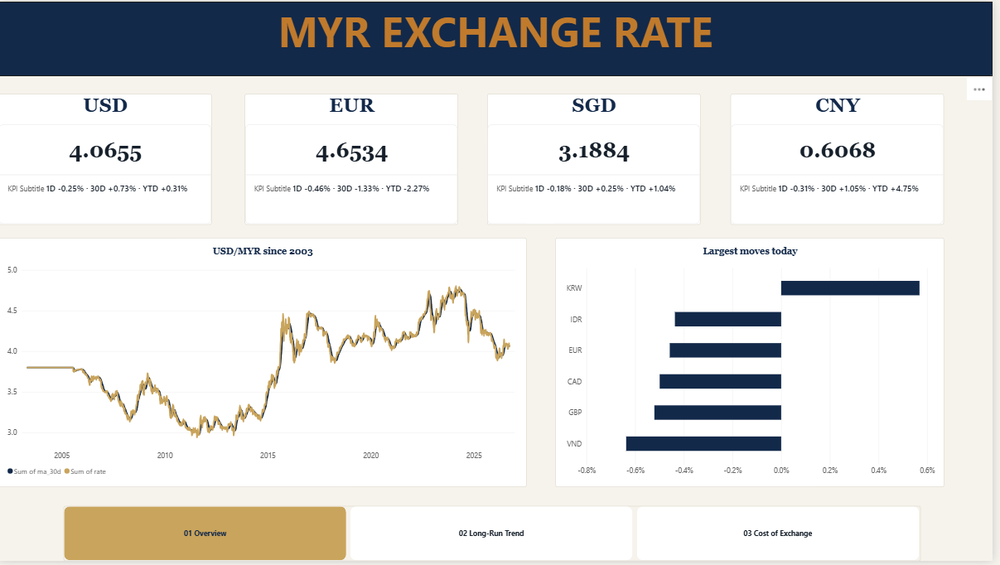
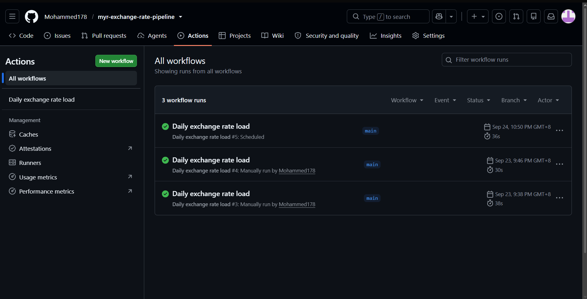
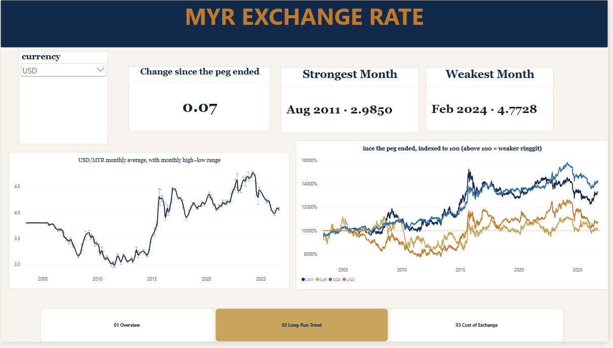
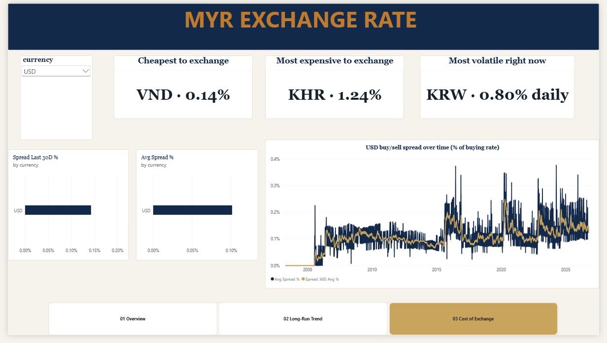
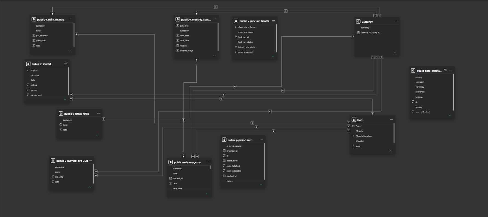

# MYR Exchange Rate Pipeline

An automated pipeline that loads Bank Negara Malaysia's daily ringgit exchange rates into PostgreSQL every weekday, checks the data for errors, and feeds a three-page Power BI report.

- **Data:** BNM 09:00 rates for 27 currencies, 2003 to present, buying / middle / selling. About 380,000 rows.
- **Stack:** Python (pandas, requests), Supabase PostgreSQL, SQL views, GitHub Actions, Power BI (DAX, star schema).
- **Runs by itself:** GitHub Actions loads new data every weekday at 18:00 MYT and logs every run.
- **Checked by hand:** every anomaly the checks flagged was traced to either a source error or a real-world event before deciding what to do with it. See [Data-quality findings](#data-quality-findings).



> **Reading the numbers:** the ringgit is the numerator, so a **higher** rate means a **weaker** ringgit.

## Architecture

```
data.gov.my API          pipeline/ (Python)              Supabase PostgreSQL               Power BI
exchangerates_  ──────>  fetch.py: fetch, reshape  ───>  exchange_rates  ──> SQL views ──>  3-page report
daily_0900               load.py:  correct, validate,    pipeline_runs       (004)          (Import mode,
                                   upsert, log                                               read-only login)
        ▲
GitHub Actions cron, weekdays 18:00 MYT (.github/workflows/daily_load.yml)
```

1. **Fetch** (`pipeline/fetch.py`) calls the data.gov.my API, retrying on rate limits and server errors, and reshapes the wide response (one column per currency) into long rows: `(date, rate_type, currency, rate)`.
2. **Correct** (`pipeline/load.py`) drops rows the source is known to have published wrongly (`drop_known_bad_rows`) and swaps back buying/selling labels published the wrong way round (`fix_swapped_spreads`).
3. **Validate** stops the run on structural errors and only warns on source anomalies (see design decisions below).
4. **Load** upserts on the primary key `(date, rate_type, currency)`.
5. **Log** writes each run to `pipeline_runs` with status, row counts, latest date and any error. A failed run exits non-zero, so it shows as failed in GitHub Actions.

The daily run re-fetches the last 7 days, so a missed or failed run fills itself in on the next one.



## Power BI report

Three pages in an executive-briefing style, connected to Supabase with a read-only login.

| Page | What it shows |
|---|---|
| 01 Overview | Latest USD, EUR, SGD and CNY rates with 1-day, 30-day and year-to-date change; USD/MYR since 2003 with a 30-day moving average; the day's largest moves. |
| 02 Long-run trend | Monthly average with high–low range for a chosen currency; strongest and weakest month; USD, EUR, SGD and CNY indexed to 100 from the end of the USD peg. |
| 03 Cost of exchange | Cheapest and most expensive currency to exchange (buy/sell spread, last 30 days); most volatile currency; spread over time with a 30-day average. |





The model is a star schema: `Date` and `Currency` dimension tables filter the rate table and the SQL views. The report file is [`powerbi/myr_daily_pipeline.pbix`](powerbi/myr_daily_pipeline.pbix), and the DAX measures for each page are in `powerbi/measures_page1.dax` to `measures_page3.dax` (latest rate and 1D / 30D / YTD change; peg-end index and strongest / weakest month; spread and volatility). The custom theme is [`powerbi/theme-institutional-briefing.json`](powerbi/theme-institutional-briefing.json).



## What the data shows

- **USD was pegged at 3.80 until 21 July 2005.** The USD/MYR line is flat until then.
- **The USD buy/sell spread was 0% under the peg.** It only appeared once the ringgit floated.
- **Spreads have been wider and more volatile since 2015.**
- **Caveat on averages:** averaging spreads across all currencies shows a false step up around 2007. BNM added currencies then, so the mix changed, not the cost of exchange. The spread chart is therefore shown one currency at a time.

## Data-quality findings

The same check (a day-over-day move of more than 50%, `sql/007`) flagged both source errors and genuine currency crises. Each hit was checked against real-world events before deciding to correct, remove or keep it. The findings are recorded in the header comments of `sql/007` to `sql/010` and in the `data_quality_log` table (`sql/011`).

| Finding | Evidence | Action |
|---|---|---|
| Buying and selling labels swapped at source on 2004-04-16, 2004-12-07 and 2005-01-10 (10 rows) | The middle rate sits exactly between each swapped pair, e.g. EUR 2004-04-16: (4.5413 + 4.4843) / 2 = 4.5128 vs published 4.5126 | Corrected in `load.py` (`fix_swapped_spreads`) |
| HKD, JPY and SGD spreads of about 0.01% on 2005-01-10, against a normal ~2% | Only on that one day | Kept; likely a different pricing basis |
| CNY before 2005-05-05 published as 31.45 | 31.45 = 3.80 × 8.2765 (the two USD pegs multiplied); the correct cross rate is 3.80 / 8.2765 = 0.4591, which matches the value from 5 May 2005 | Removed: `sql/008` for loaded data, `load.py` (`drop_known_bad_rows`) so future backfills stay clean |
| SAR on 2020-11-06: selling rate below both buying and middle | SAR is pegged to USD, which implies about 1.10, not 1.0846 | Flagged and kept; true value unknown |
| MMK dropped 99% on 2012-04-03 | Myanmar moved from a fixed rate to a managed float in April 2012; rates match both regimes | Kept (real event) |
| EGP spreads up to 6.9% in November 2016 | Egypt floated the pound on 3 November 2016; spreads widen from the first trading days after | Kept (real event) |
| BND deviates from SGD by -0.4% to +1.4% in April–May 2018 | BND is pegged 1:1 to SGD, so middle rates should match (`sql/010`) | Kept; treated as an indicative quote |
| XDR has a middle rate only | XDR is the IMF's Special Drawing Right, a reserve asset with no retail market | By design: excluded from spread and completeness checks |

## Key design decisions

- **Long format** `(date, rate_type, currency, rate)` instead of one column per currency. A new currency from BNM becomes new rows, not a schema change.
- **Idempotent upserts** on `(date, rate_type, currency)`. Re-running any day is safe and never duplicates.
- **7-day overlap** on every daily run, so missed runs heal themselves without manual backfills.
- **Validation that separates errors from anomalies.** Structural errors (unknown rate types, malformed currency codes, duplicate keys) stop the run. Source anomalies (e.g. buying > middle) print a warning and load as published, because the source is the record and the SQL checks in `005` keep surfacing them.
- **Read-only reporting role.** Power BI connects as `powerbi_reader` (`sql/006`), which can only `SELECT`. Writes come only from the pipeline's service key, kept in GitHub Actions secrets.
- **Star schema in Power BI.** `Date` and `Currency` dimensions let one slicer filter every table and view consistently.

## Repository layout

```
pipeline/
  fetch.py                 API client and wide-to-long reshape
  load.py                  entry point: correct, validate, upsert, log
  requirements.txt
  .env.example
sql/
  001_create_tables.sql    exchange_rates, pipeline_runs
  002_indexes.sql
  003_rls_policies.sql     row-level security: public read, no public writes
  004_views.sql            latest rates, daily change, monthly summary, 30-day MA, spread, pipeline health
  005_validation_checks.sql  manual data-quality checks
  006_powerbi_reader_role.sql  read-only login for Power BI
  007_check_unit_changes.sql   >50% daily moves           ┐
  008_remove_bad_cny_2005.sql  CNY fix                    │ data-quality
  009_largest_spreads.sql      widest spreads             │ investigations
  010_check_bnd_vs_sgd.sql     BND vs SGD peg             ┘
  011_data_quality_log.sql     table of all findings, read by Power BI
powerbi/
  myr_daily_pipeline.pbix   the Power BI report
  measures_page1.dax       DAX: overview KPIs, largest moves, pipeline status
  measures_page2.dax       DAX: indexed to peg end, strongest / weakest month
  measures_page3.dax       DAX: spread, volatility, cheapest / costliest currency
  theme-institutional-briefing.json  report theme (colours, fonts)
docs/screenshots/          report, data model and Actions screenshots
.github/workflows/
  daily_load.yml           scheduled run
```

## Setup

**Database (Supabase)**

1. Create a Supabase project.
2. In the SQL Editor, run `001` to `004`, then `006` (replace `CHANGE_ME` with a real password first; don't commit it) and `011`.
3. `005`, `007`, `009` and `010` are read-only checks to run by hand. `008` is a one-off delete to run after the backfill.

**Pipeline**

```bash
cd pipeline
pip install -r requirements.txt
cp .env.example .env          # fill in SUPABASE_URL and SUPABASE_SERVICE_ROLE_KEY
python load.py --backfill     # full history since 2003, run once
python load.py                # last 7 days, what the schedule runs
```

For the schedule, add `SUPABASE_URL` and `SUPABASE_SERVICE_ROLE_KEY` as GitHub Actions repository secrets. The workflow also has a manual "Run workflow" button.

**Power BI**

Open `powerbi/myr_daily_pipeline.pbix` and point it at your own Supabase project (*Transform data → Data source settings*). These two steps were the real snags:

1. **Connect through the Session pooler, not the direct connection.** In Supabase, open *Connect* and copy the Session pooler host (port 5432). In Power BI, use *Get data → PostgreSQL database* with that host and database `postgres`, then sign in with the database username `powerbi_reader.<project-ref>` (the pooler needs the project ref appended to the role name).
2. **Trust Supabase's CA certificate on Windows.** Supabase requires SSL, and Power BI rejects the connection until Windows trusts the certificate. Download it from Supabase (*Database settings → SSL configuration*), then import it into *Trusted Root Certification Authorities* using `certmgr.msc`.

## Limitations

- **The Power BI report is refreshed by hand.** It uses Import mode, and scheduled refresh in the Power BI Service needs a work or school account. The pipeline and database update automatically every weekday; only the report refresh is manual.
- **Source anomalies are kept as published** unless the evidence shows the correct value (see findings table).
